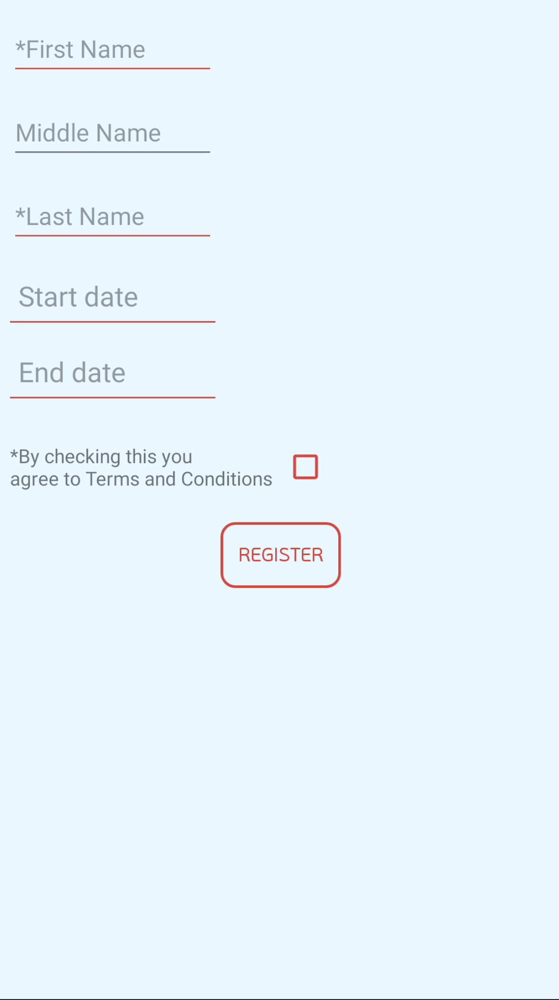

# FormLibrary
## _Simple android Form Library_

The FromLibrary simplifies the process of building custom forms in android. The idea is to extend the standard android user input classes (EditText, CheckBox...) with the goal of adding the following functionality:

- ability to define input validator through xml parameters. The input validator will be used to validate the user input.
- the ability to combine all of the input into a form which will have two states, valid if all form items are valid or invalid otherwise.


The library includes the following views:

- FormCheckBox
- FormDatePickerTextView
- FormEditText
- FormRadioGroup

The intention of the library is to simplify the creation of forms following a couple of simple steps:

1. Add all form elements to one of the containers (_ConstraintLayout, FrameLayout..._)
2. Create an instance of the _BasicForm_ in the Activity and provide it with the container containing the form elements
3. Observe the form status in parent activity


All classes have two additional attributes:

- isRequired - set to false if the form field is optional, otherwise must be set to true;
- validator - string containing the full name of the validator class.

Validators are classes that implement the *LeafFormItem.ItemValidator<T>* interface and are used to validate the user input. The validators are used to check each form input individually in order to check the validity of the whole form. In order to add new validator, the validator class must implement the before mentioned interface and add a full class name to *String.xml* file. Here is an example of String.xml file with all the default validators:

```xml

<resources>
    <string name="app_name">FormLibrary</string>
    <string name="NonEmptyStringValidator">ab.utili.form.validators.NonEmptyStringValidator</string>
    <string name="RadioGroupItemSelectedValidator">ab.utili.form.validators.RadioGroupValueSelectedValidator</string>
    <string name="NonEmptyDateValidator">ab.utili.form.validators.NonEmptyDateValidator</string>
    <string name="CheckBoxValidator">ab.utili.form.validators.CheckBoxValidator</string>
    <string name="FormRadioGroupValidator">ab.utili.form.validators.FormRadioGroupValidator</string>
    <string name="IsEmailValidator">ab.utili.form.validators.IsEmailValidator</string>
</resources>

```

And here is the example of the email validator implementation:

```java

package ab.utili.form.validators;

import android.text.TextUtils;
import ab.utili.form.forms.LeafFormItem;

public class IsEmailValidator implements LeafFormItem.ItemValidator<String> {
    @Override
    public boolean isValid(String s) {
        if(!TextUtils.isEmpty(s)){
            return android.util.Patterns.EMAIL_ADDRESS.matcher(s).matches();
        }
        return false;
    }
}

```


The FormDatePickerTextView is used to pick date by tapping on regular text view, which then shows the date picker dialog and after the date is picked, the picked date is set in the text view. FormDatePickerTextView has additional attributes

- datePattern - pattern used to present the picked date;
- dateBefore - a reference to the FormDatePickerTextView whose date must come before the current one
- dateAfter - a reference to the FormDate


## 1. Adding elements to the container
To build a simple form, add elements to one of the ViewGroup containers. A simple form is given in *Figure_01*.

<center>
<p>

</p>
*Figure_01 - Simple form*
</center>

<details>
  <summary><b>Click to view the xml layout!</b></summary>
  
```xml
<?xml version="1.0" encoding="utf-8"?>
<ConstraintLayout xmlns:android="http://schemas.android.com/apk/res/android"
    xmlns:app="http://schemas.android.com/apk/res-auto"
    xmlns:tools="http://schemas.android.com/tools"
    android:id="@+id/new_user_form_container"
    android:layout_width="match_parent"
    android:layout_height="match_parent"
    tools:context=".MainActivity">

    <FormEditText
        android:id="@+id/first_name_et"
        style="@style/form_edit_text_style"
        app:layout_constraintTop_toTopOf="parent"
        app:layout_constraintStart_toStartOf="parent"
        android:hint="*First Name"
        app:isRequired="true"
        app:validator="@string/NonEmptyStringValidator"/>

    <FormEditText
        android:id="@+id/middle_name_et"
        android:layout_width="150sp"
        android:layout_height="wrap_content"
        app:layout_constraintTop_toBottomOf="@id/first_name_et"
        app:layout_constraintStart_toStartOf="parent"
        android:layout_marginLeft="8dp"
        android:layout_marginTop="16dp"
        android:hint="Middle Name"
        />

    <FormEditText
        android:id="@+id/last_name_et"
        style="@style/form_edit_text_style"
        app:layout_constraintTop_toBottomOf="@id/middle_name_et"
        app:layout_constraintStart_toStartOf="parent"
        android:layout_marginLeft="8dp"
        android:hint="*Last Name"
        app:isRequired="true"
        android:inputType="text"
        app:validator="@string/IsEmailValidator"/>
    

    <FormDatePickerTextView
        android:id="@+id/start_date"
        android:layout_width="150sp"
        android:layout_height="wrap_content"
        android:hint="Start date"
        app:layout_constraintTop_toBottomOf="@id/last_name_et"
        app:layout_constraintStart_toStartOf="parent"
        android:padding="6dp"
        android:background="@drawable/underline"
        android:layout_marginLeft="8dp"
        android:textSize="20dp"
        android:layout_marginTop="16dp"
        app:isRequired="true"
        app:validator="@string/NonEmptyDateValidator"
        app:datePattern="dd / MM / yyyy"/>

    <FormDatePickerTextView
        android:id="@+id/end_date"
        android:layout_width="150sp"
        android:layout_height="wrap_content"
        android:hint="End date"
        app:layout_constraintTop_toBottomOf="@id/start_date"
        app:layout_constraintStart_toStartOf="parent"
        android:padding="6dp"
        android:layout_marginTop="16dp"
        android:background="@drawable/underline"
        android:layout_marginLeft="8dp"
        android:textSize="20dp"
        app:isRequired="true"
        app:validator="@string/NonEmptyDateValidator"
        app:datePattern="dd / MM / yyyy"/>

    <TextView
        android:id="@+id/terms_conditinos_tv"
        android:layout_width="wrap_content"
        android:layout_height="wrap_content"
        app:layout_constraintStart_toStartOf="parent"
        app:layout_constraintTop_toBottomOf="@id/end_date"
        android:layout_marginTop="32dp"
        android:layout_marginLeft="8dp"
        android:text="*By checking this you \nagree to Terms and Conditions"/>

    <FormCheckBox
        android:id="@+id/form_check_box"
        android:layout_width="40dp"
        android:layout_height="40dp"
        app:layout_constraintTop_toTopOf="@id/terms_conditinos_tv"
        app:layout_constraintBottom_toBottomOf="@id/terms_conditinos_tv"
        app:layout_constraintStart_toEndOf="@id/terms_conditinos_tv"
        app:isRequired="true"
        android:buttonTint="@color/brand_text_color_highlighted"
        app:validator="@string/CheckBoxValidator"
        android:layout_marginLeft="8dp"/>

    <AppCompatButton
        android:id="@+id/register_button"
        android:layout_width="wrap_content"
        android:layout_height="wrap_content"
        android:text="Register"
        app:layout_constraintTop_toBottomOf="@id/form_check_box"
        app:layout_constraintStart_toStartOf="parent"
        app:layout_constraintEnd_toEndOf="parent"
        android:padding="4dp"
        android:layout_marginTop="20dp"
        android:textColor="@drawable/custom_button_text_color"
        android:fontFamily="@font/pfbeausansproregular"
        android:enabled="false"
        android:background="@drawable/custom_button"/>
</ConstraintLayout>

      
``` 
</details>


## 2. Activity

In order to link the form with the form elements added in the xml file, the BasicForm instance must be added to activity.


```java

public class MainActivity extends AppCompatActivity {
    private BasicForm form;

    @Override
    protected void onCreate(Bundle savedInstanceState) {
        super.onCreate(savedInstanceState);
        setContentView(R.layout.activity_main);

        form = new BasicForm(true);
        ConstraintLayout formContainer = findViewById(R.id.new_user_form_container);
        form.loadFormItemsFromLayout(formContainer);

        Button registerButton = findViewById(R.id.register_button);

        form.getItemStatus().observe(this, new Observer<FormItem.ItemStatus>() {
            @Override
            public void onChanged(FormItem.ItemStatus itemStatus) {
                if(itemStatus.equals(FormItem.ItemStatus.Valid)){
                    registerButton.setEnabled(true);
                } else {
                    registerButton.setEnabled(false);
                }
            }
        });

    }
}

``` 

Since BasicForm also implements the FormItem interface, it also has the "isRequeired" attribute which is set through constructor:

```java
        form = new BasicForm(true);
``` 

The form elements are loaded into form using the BasicForm's *loadFormItemsFromLayout(ViewGroup viewGroup)* method.

```java
        ConstraintLayout formContainer = findViewById(R.id.new_user_form_container);
        form.loadFormItemsFromLayout(formContainer);
``` 

In the above example, the constraint layout with the id *new_user_form_container* holds all form elements.

## 3. Observing form status
    
All that is left to do after that is observer the form and respond to its status changes:

```java
        form.getItemStatus().observe(this, new Observer<FormItem.ItemStatus>() {
            @Override
            public void onChanged(FormItem.ItemStatus itemStatus) {
                if(itemStatus.equals(FormItem.ItemStatus.Valid)){
                    registerButton.setEnabled(true);
                } else {
                    registerButton.setEnabled(false);
                }
            }
        });
``` 

The form status can be *Valid* or *Invalid*. 


